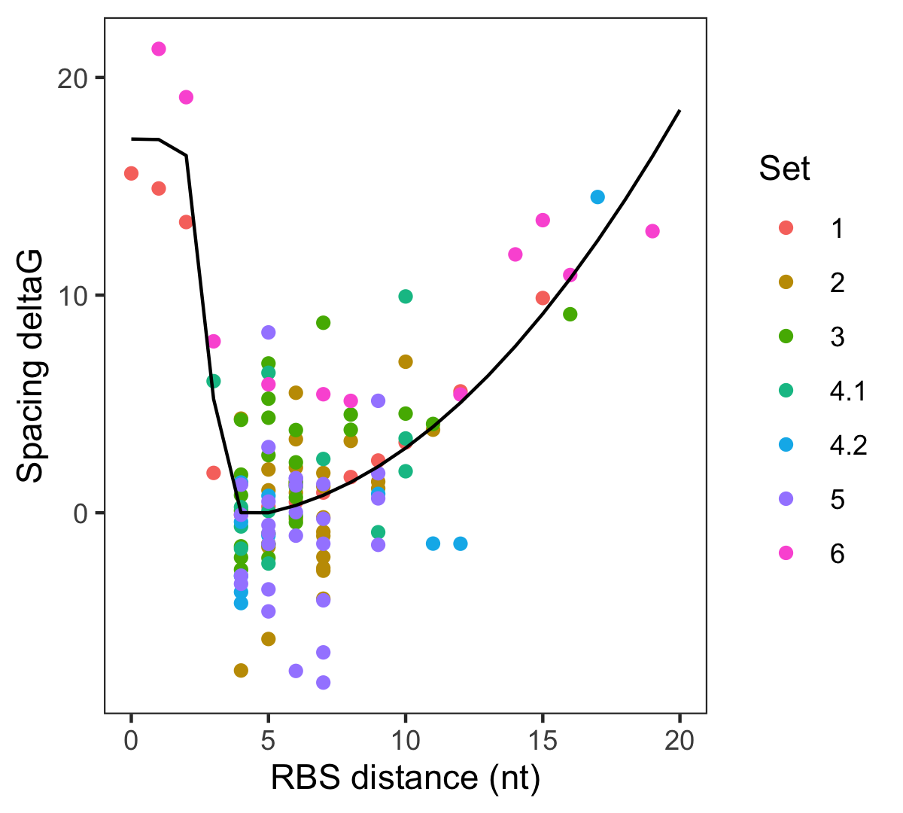
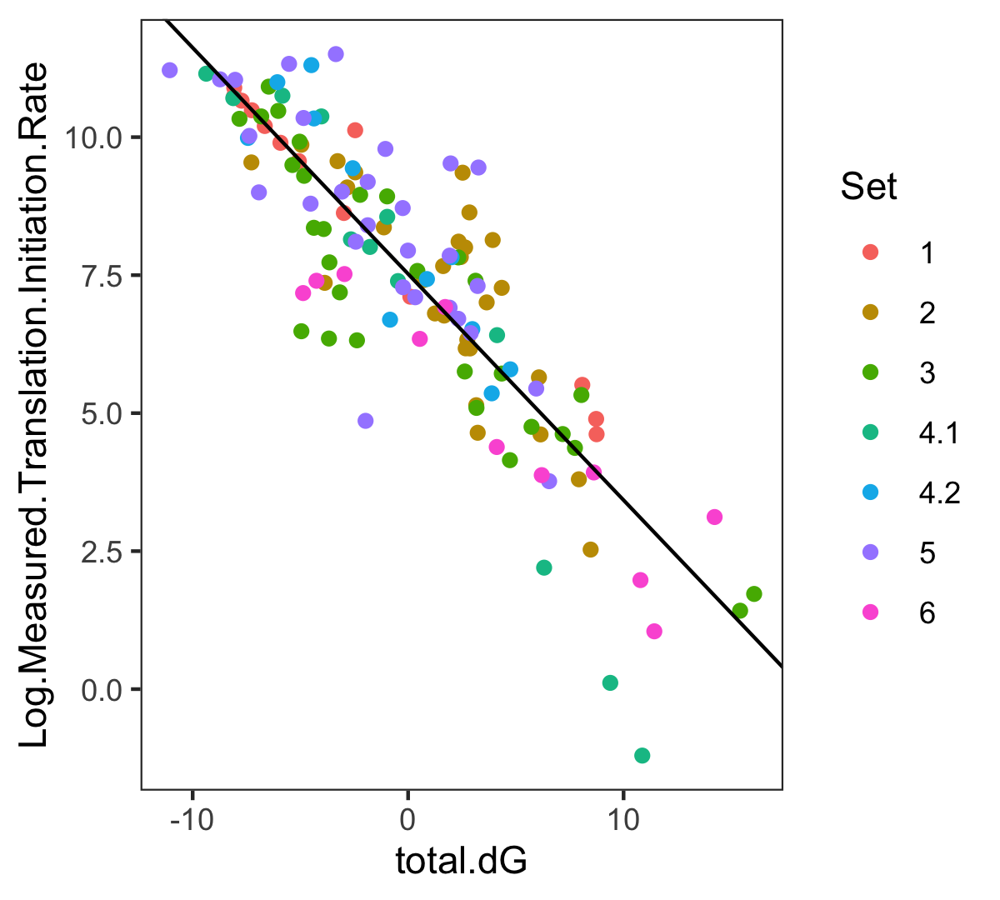
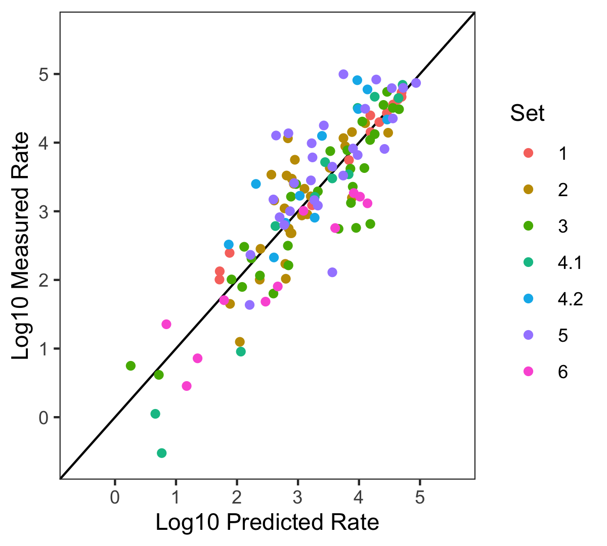
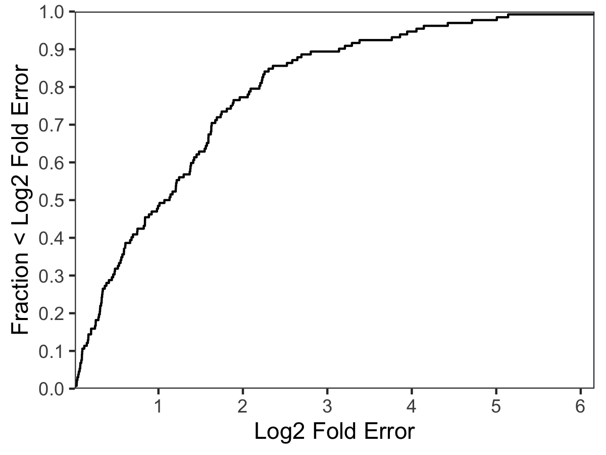

# OSTIR Calibration

This directory contains the input file and R script used to calibrate the energy model parameters used by OSTIR with ViennaRNA 2.4.18 and the default turner2004 energy parameters.

The data is from: Salis HM, Mirsky EA, Voigt CA. 2009. Automated design of synthetic ribosome binding sites to control protein expression. _Nat. Biotechnol._ **27**:946–950.

The fitting procedure used by OSTIR also follows the procedure from Salis et al. 2009, except with some modifications described in the R script.

Use this command to run the calibration:
```bash
Rscript ostir_calibration.R
```

The file `input.csv` must have the Δ*G* values that have all components except for the Δ*G*(spacing)!

## Fitting Δ*G*(spacing)



## Total Δ*G* versus measured translation initiation rate



## Predicted versus measured translation initiation rates



## Fold error predicted versus measured



Fraction of measurements with < 2-fold error: 0.523

Fraction of measurements with < 4-fold error: 0.758

Fraction of measurements with <10-fold error: 0.909
